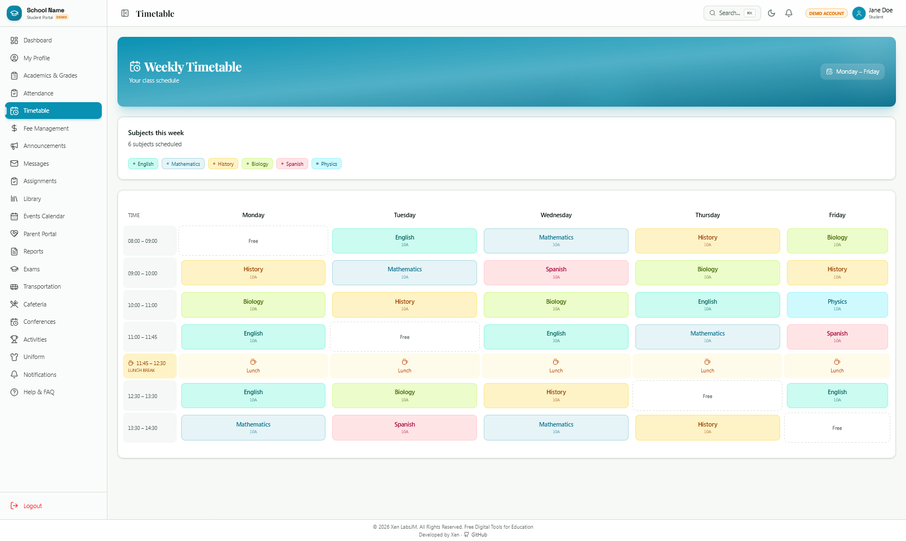

# IMAGES FOR THE PROJECT
- LOGIN PAGE (Dark Theme)

- Login Light Mode

- ADMIN DASHBOARD (Dark Theme) PAGE

- ADMIN DASHBOARD (Light Theme) PAGE (Colour changed to Rose)

- Admin Settings Page

- Admin Profile Page

- Colour Change for the Theme

- Student Dashboard Page (light theme)

- Add Student Page (70% Magnification)

- Student Timetable Page

- Teacher Dashboard Page (light theme)

- Teacher Timetable Page (light theme)
